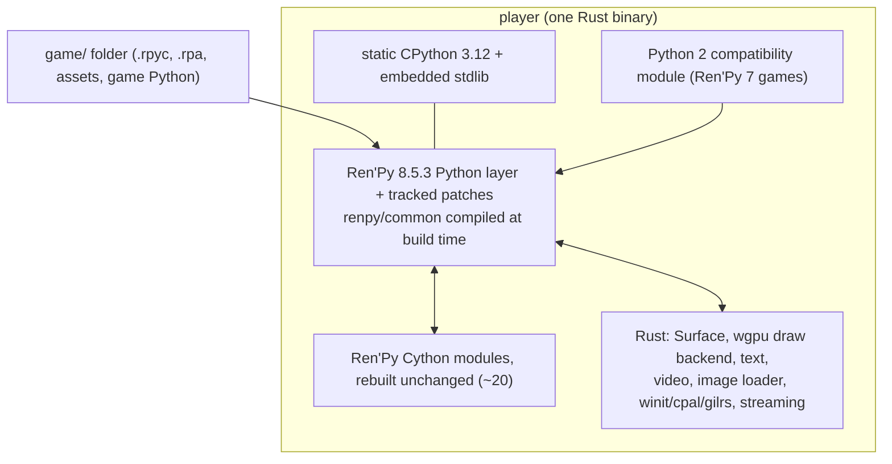

# Architecture: Ren'Py 7/8 player

The build handoff from the planning map, [Map: Ren'Py 7/8 player feasibility and architecture](https://github.com/jeiang/renpy_proj/issues/1). Each decision links to the ticket that holds its detail, and to its fact sheet under `research/`. Vocabulary is in [`CONTEXT.md`](CONTEXT.md).

## Goal

A single player binary that runs existing Ren'Py 7 and 8 games on macOS, Linux and Windows, and streams them to a browser on the LAN. It must be faster than stock Ren'Py on high-resolution video, cold scene changes and startup.

Hard goal: a game runs from its `game/` folder alone. The game's `lib/`, `renpy/`, `Game.exe` and `Game.sh` are never executed. `lib/` and `renpy/`, if present, are only read to detect the engine version.

## Route

A **Rust host running Ren'Py's Python layer**, made thinner over time ([Choose the route](https://github.com/jeiang/renpy_proj/issues/12)).

- **One engine layer:** Ren'Py 8.5.3, the compat baseline. Every game runs on it through Ren'Py's own compat flags plus engine patches. Later Ren'Py releases are deferred.
- **What stays Python on any route:** the game's own Python, the store and rollback, classes named in pickles (`.rpyc` and saves), the `renpy.*` API, and custom displayables.
- **Strangler:** once the desktop platforms reach parity, Python subsystems move to Rust one at a time behind the same Python API. Profiling picks the first candidate. Each move must pass the corpus gate.

## Components

### Embedded Python ([pypack](research/pypack/README.md), [win-spike](research/win-spike/README.md))
- Static CPython 3.12, built by us on each OS. python-build-standalone's macOS and Linux static libraries are LLVM 22 bitcode, which Apple clang does not link. On Windows, either its COFF objects or our own `/MT` build work.
- The stdlib (minus tests, tk and idlelib, about 4 MB zipped), the Ren'Py Python layer and `renpy/common` are embedded as bytes in the executable and loaded by an in-memory importer. `encodings` is frozen.
- Never append data to a signed executable: it breaks macOS strict codesign and Windows Authenticode.
- Windows: every library is built `/MT`. The static build lacks `sys.dllhandle`, and the build needs `PYTHONUTF8=1`.
- Linux: a glibc-dynamic host, so GPU libraries can load at runtime ([INFERENCE], untested).

### Engine layer and patches ([boundary](research/boundary/README.md), [Rust–Python boundary](https://github.com/jeiang/renpy_proj/issues/21))
- The player bundles **Ren'Py 8.5.3 plus tracked patches**. Patches are files in the repo, in the same format as engine patches in the patch library. They are applied at build time and re-checked when Ren'Py is upgraded.
- **Rebuilt unchanged:** `astsupport`, `cslots`, `lexersupport`, `pydict`, `style`/`styledata`, `encryption`, `tfd`, `display.matrix/render/quaternion`, `audio.filter`, `text.textsupport/texwrap`, and `gl2polygon/gl2mesh*`.
- **Patched (one line each):** `accelerator`, `gl2model`.
- **Replaced by Rust:** everything GL, SDL, FFmpeg or FreeType.
- **`Surface`:** a Rust `#[pyclass(subclass)]` with the buffer protocol, subclassed by `pgrender.Surface`. During bring-up, stock text renders over it through the proven C-capsule shim. Text then moves to Rust, and sets `Glyph`/`Line` fields through Python attributes until profiles say otherwise.
- **Renderer registration:** a real "wgpu" backend name, added by a one-line `core.py` patch.
- **Stubs:** `assimp`, which raises "not supported" (the pre-flight report flags games that load 3D models), and `00director.rpy`, whose licence is non-commercial only.
- **`renpy/common`** is compiled at build time by Ren'Py's parser, running inside the embedded interpreter.

### Renderer ([renderer](research/renderer/README.md), [ticket](https://github.com/jeiang/renpy_proj/issues/22))
- wgpu (Metal, Vulkan, D3D12). The GL2 model renderer maps directly onto it: it uses no stencil or scissor, and clipping is done on the CPU.
- Render-to-texture flips Y per pass. Mipmaps are generated with a blit chain. Pipelines are precompiled at load, because a cold pipeline costs about 135 ms.
- **GLSL translator:** a Rust source rewriter in front of naga's GLSL front end, working on the fully assembled program. It widens uniform arrays to vec4 (otherwise Metal silently drops draws), stores `mat2` as vec4 and `bool` as int, and forces MIN/MAX blend factors to One. All 50 built-in shader programs translate.
- **Risks:** naga's relaxed fragment uniformity check depends on an internal constant, so re-check it on every wgpu upgrade. Anisotropic filtering semantics differ from GL and need a visual check. D3D12 and Vulkan are untested.

### Video ([video-proto](https://github.com/jeiang/renpy_proj/tree/prototype/video-proto), [ticket](https://github.com/jeiang/renpy_proj/issues/23))
- An LGPL FFmpeg 7+ build (never `--enable-gpl` or `--enable-nonfree`), shipped as shared libraries. Hardware decode where available (VideoToolbox, D3D11VA, VAAPI/NVDEC), dav1d for AV1, software otherwise.
- YUV planes (NV12, P010, yuv420p/444p, planar RGB gbrp as an identity path) upload to wgpu, and a WGSL shader converts them. This removes stock Ren'Py's swscale, RGBA, zeroing and copy costs.
- Hooked in through a tracked `video.py` patch that accepts a GPU texture.
- **Prototype result (M3 Pro):** AstralLust 4K60 10-bit VP9 plays at 60 fps on 0.2 cores (stock: 8 fps, 3.35 cores). Every corpus clip, including H.264, which stock 8.5.3 can't decode, holds 60 fps.

### Image loading ([images](research/images/README.md), [ticket](https://github.com/jeiang/renpy_proj/issues/24))
- A Rust worker pool decodes images (png or zune-png, turbojpeg, libwebp, dav1d for AVIF), premultiplies them and stages the upload, with the GIL released.
- Three tracked engine patches: `pygame.image.load` backed by Rust, `Cache.preload_image` prefetch, and a final predict that doesn't block.
- The image cache is sized from GPU memory (about 1.5–2 GB instead of 400 MB). A VRAM query per backend is still unverified.
- Estimated cold 1080p freeze: 10–30 ms, down from 68–106 ms. This is not measured end to end.

### Window, input and audio
- winit + cpal + gilrs replace SDL. IME text entry and gamepad mapping must be checked against SDL's behaviour. Key constants keep SDL's numeric values.

### Streaming ([streaming](research/streaming/README.md), [ticket](https://github.com/jeiang/renpy_proj/issues/25))
- The player renders offscreen and encodes its own frames: no virtual display, no screen capture, no OS input injection.
- WebRTC via str0m, signalling via axum (one page and `POST /offer`, LAN host candidates only).
- H.264 through FFmpeg hardware encoders (VideoToolbox, NVENC/AMF/QSV/MF, VAAPI), with openh264 as the software fallback. Audio is Opus.
- Input arrives over two data channels (reliable, and unordered for pointer moves). Encoding is damage-aware: it skips frames where nothing changed.
- Started with `player serve <game>` (headless, prints a LAN URL) or a Stream button in the library.

## Ren'Py 7 games ([compat module](https://github.com/jeiang/renpy_proj/issues/19), [prototype](https://github.com/jeiang/renpy_proj/tree/prototype/py2compat-proto))
- **Detection:** from the bundled engine (the `renpy/` version or `lib/python2.7`), not from `script_version.txt`. A bare `game/` folder is guessed from `.rpyc` markers, and the user can override the guess.
- **Python 2 semantics at compile time** (the `py_compile`/`wrap_node` AST pass, plus an import hook for loose `.py` files):
  - `/` floors when both operands are ints;
  - Python 2 `round()`;
  - list-returning `keys`/`values`/`items`/`map`/`filter`/`zip`;
  - the missing names;
  - `exec` inside functions, through a namespace dict;
  - `__metaclass__`, `__eq__` without `__hash__`, `iteritems`/`has_key`, and `cmp` sorts.
- **Python 2 syntax:** a token-level fixer rewrites it before compile (`print`/`exec` statements, backticks, `<>`, `ur''`, old octal literals). Every rewritten site is listed in the pre-flight report.
- **At runtime:** the error is classified. For a known pattern, such as mixed-type ordering, the code is recompiled, swapped and rolled back, then the statement is retried. Anything else shows a report. A fixed error goes into the per-game runtime report, so a `traceback.txt` always means an unfixed error.
- **Engine differences:** restore the `images/` search prefix, accept parser leniencies such as valueless properties, and skip decompiler stubs such as `un.rpyc`.
- **Port patches:** TOML files that replace a named node's code, matched by file, line and a hash of the original source. They are applied in memory and never rewrite `.rpyc`. They live in the player-side patch library, keyed by build fingerprint. Never delete a game's original `.rpyc`: that makes saves resume at the wrong line with no error.
- **Pre-flight report:** written after load and before init. It supplies the Ren'Py 7 warning, which shows once in the library and again in-game whenever the module steps in.

## Saves and data ([savecompat](research/savecompat/README.md), [UX](https://github.com/jeiang/renpy_proj/issues/30))
- Stock saves load in the player. Player saves need not load in stock Ren'Py.
- The player writes to its own save folder and imports stock saves on first open. It never writes to the stock save folder or to `persistent`.
- Before loading, a static detector checks each save in four layers: metadata, a pickle opcode scan, class resolution, and a stub unpickle with a namemap walk. It agreed with real loads on 356 of 356 saves.
- The Rust layer must keep `Style`, `Matrix`/`Matrix2D`, `PyExpr`, the `renpy.audio.filter` classes and `Rect` pickle-compatible.
- Compiled caches live in the player's own per-game cache folder, keyed by build fingerprint. The player never reads a game's shipped `game/cache` (a stale shipped cache is what caused the line-range crash).
- The player never writes into the game folder. This covers more than `game/cache`: stock Ren'Py writes a `.rpyc` beside every `.rpy` it compiles, and syntax-fixer rewrites force such recompiles. A tracked engine patch sends `.rpyc` output (and `bytecode` caches) to the per-game cache folder, which is read before the game's own `.rpyc` when the source hash matches.
- Engine patches: common ones are player settings (for example, skipping save signature checks). The rest go through the patch library.

## User experience ([UX](https://github.com/jeiang/renpy_proj/issues/30))
- A library that scans the folders you choose, including nested ones, plus `player <path>`. The library shows the engine version, Ren'Py 7 status, patches and the pre-flight result.
- Patches are plain files, handled by CLI list, validate and apply-test commands. The AI upgrade pass writes the same format.

## Licensing ([licence](research/licence/README.md))
Private for now, and kept publishable later. Nothing is GPL-only, provided these rules hold:
- **FFmpeg:** an LGPL build, shipped as shared libraries.
- **`00director.rpy`:** excluded.
- **Ren'Py's LGPL leftovers:** fribidi, `sysfont.py` and `SDL_gfx` are not carried over.
- **FreeType:** used under the FTL licence.
- **Attributions:** Twemoji needs CC-BY attribution, and dav1d, libaom and libvpx need their patent notices.
- **Rust crates:** where a crate is dual-licensed, pick the permissive option.
- **Checks:** run `cargo deny` and `cargo about` in CI.

## Milestones ([milestone plan](https://github.com/jeiang/renpy_proj/issues/31))

Each milestone is a GitHub issue labelled `build`. Gates are the harness tiers from the [compat harness](https://github.com/jeiang/renpy_proj/issues/29), and they rise from milestone to milestone.

| # | Milestone | Acceptance gate |
|---|---|---|
| M1 | **Vertical slice (macOS):** the Rust host boots the bundled 8.5.3 layer from SecretIsland's `game/` only. The wgpu backend, Rust `Surface`, stock text over the shim, winit/cpal and the new video pipeline take it to the main menu, a new game, dialogue, and one VP9 video. | `lint` plus the probe with no traceback, and screenshots of the menu, dialogue and video. **Passed** (code in `player/`). |
| H | **Harness**, built alongside M1: turn the research scripts (`visual-confirm`, `renpy7-on-8`, `savecompat`, `perf-baseline`) into the automated gate. | The M2 gate runs automatically against stock Ren'Py. **Done** (`harness/`). |
| M2 | **macOS parity for Ren'Py 8 games:** image loader, Rust text, audio, the save detector and import, library and CLI, pre-flight report, packaging (single signed binary). | The full gate (lint, probe, stock-save resume, stock frame-diff) on every Ren'Py 8 corpus game. Video: zero drops in every run on a quiet machine, with A/V sync, inside Ren'Py. **Passed** (`harness/M2-status.md`). |
| M3 | **Ren'Py 7:** the Python 2 compatibility module, including the syntax fixer, the patch library and the runtime report. | The full gate on all Ren'Py 7 corpus games, including Harem_Hotel. AlexsVantasticAdventure's menu-only probe is investigated. **Passed** (`harness/M3-status.md`). |
| M4 | **Linux and Windows on real GPUs:** D3D12 and Vulkan, D3D11VA and VAAPI/NVDEC video, and Windows `/MT` packaging. | The full gate on both platforms, plus the anisotropic-filtering visual check on each GPU backend. |
| M5 | **Streaming:** `player serve` and the library button. | A LAN browser session plays a corpus game with input, audio and video. Glass-to-glass latency is measured. **Passed** (`harness/M5-status.md`). |
| M6 | **AI upgrade pass** ([design](https://github.com/jeiang/renpy_proj/issues/20)): seeded deep runs find errors past the gate; a maintainer CLI sends a bounded slice to an OpenAI-compatible model; patches are verified from a save before the failing node, written as proposed, and activated by a human. Patches stay local. | Every Python 2 error the deep runs find on the 17 Ren'Py 7 games gets a verified patch, or is reported unpatchable or "needs human" with evidence. |
| Later | **Strangler:** move Python subsystems to Rust in the order profiling gives. Also build-phase optimisations such as zero-copy IOSurface video. | Each move passes the full corpus gate on all three desktops. |

## Known gaps
- No large Ren'Py 8.4+ game in the corpus (TheStormWithinUs 8.5.3 is small), no obfuscated game, and no 4K Ren'Py 8 game: see [the corpus-gaps ticket](https://github.com/jeiang/renpy_proj/issues/18).
- Windows and Linux GPU, video and streaming behaviour is unmeasured until M4 and M5.
